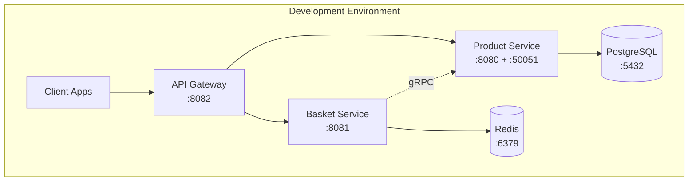
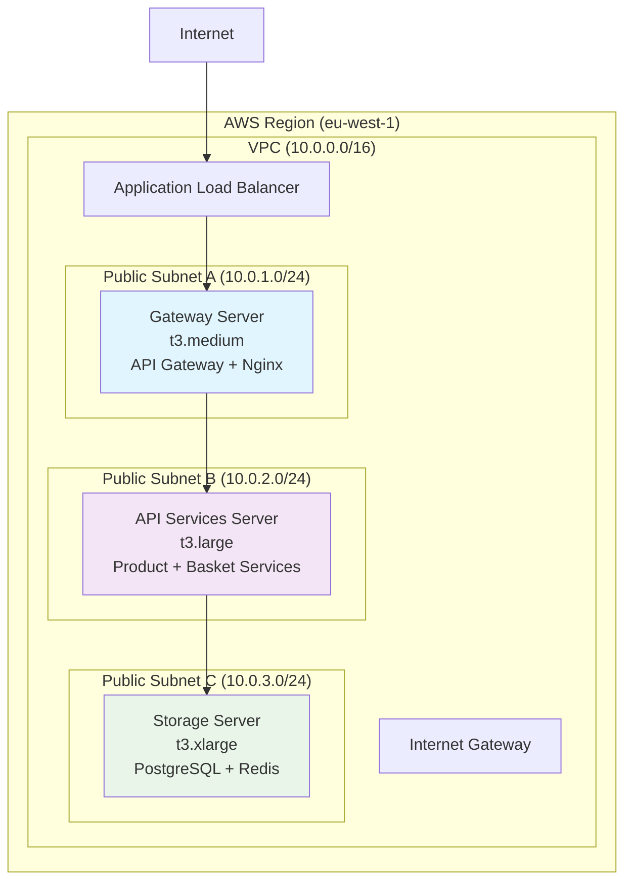
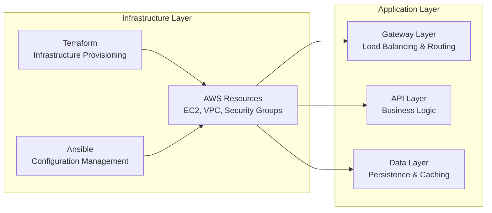
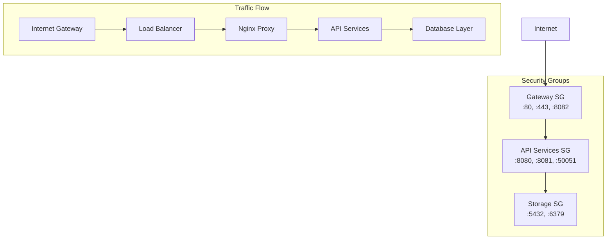

# Cluster IAC - Enterprise Microservices Infrastructure

A production-ready, cloud-native microservices architecture built with Go, featuring automated deployment to AWS using Infrastructure as Code (IaC). This project demonstrates modern DevOps practices with multi-tier architecture, container orchestration, and distributed deployment strategies.

## 🏗️ Architecture Overview

### Local Development (Docker Compose)


### AWS Production Deployment


### Infrastructure Components


## 🚀 Features

### Core Services
- **Product Management**: Full CRUD operations with category filtering and stock management
- **Shopping Basket**: Redis-based cart with real-time product validation via gRPC
- **API Gateway**: Intelligent routing with rate limiting and health monitoring
- **Multi-Protocol Communication**: HTTP/REST + gRPC for optimal performance

### Infrastructure & DevOps
- **Infrastructure as Code**: Complete Terraform configuration for AWS deployment
- **Configuration Management**: Ansible playbooks for automated service setup
- **Multi-Environment**: Docker Compose for development, AWS for production
- **Monitoring & Logging**: Built-in health checks, log aggregation, and alerting
- **Security**: VPC isolation, security groups, and SSL/TLS termination
- **Backup & Recovery**: Automated database backups with retention policies

### Deployment Strategies
- **Local Development**: Single-command Docker Compose setup
- **Cloud Production**: Automated AWS deployment with Terraform + Ansible
- **Scalable Architecture**: Multi-tier deployment across separate EC2 instances
- **Load Balancing**: Nginx reverse proxy with upstream health checks

## 🛠️ Technology Stack

### Backend Services
- **Runtime**: Go 1.24 with CGO disabled for static binaries
- **Web Frameworks**: Gin (APIs), Fiber (Gateway)
- **Database**: PostgreSQL 16 with GORM ORM
- **Cache**: Redis 7 with persistence and memory optimization
- **Communication**: HTTP/REST + gRPC with Protocol Buffers

### Infrastructure & Operations
- **Containerization**: Docker + Docker Compose
- **Cloud Provider**: AWS (EC2, VPC, Security Groups, EBS)
- **Infrastructure as Code**: Terraform 1.0+
- **Configuration Management**: Ansible 2.9+
- **Web Server**: Nginx with rate limiting and SSL support
- **Monitoring**: Prometheus Node Exporter, custom health checks

## 🚀 Quick Start

### Prerequisites

#### For Local Development
- Docker and Docker Compose
- Go 1.24+ (optional, for development)
- Make (optional, for convenience commands)

#### For AWS Deployment
- AWS CLI configured with appropriate credentials
- Terraform 1.0+
- Ansible 2.9+
- SSH key pair for EC2 access

### Option 1: Local Development with Docker

1. **Clone and start services**:
```bash
git clone https://github.com/ozturkeniss/Multi-VM-Infrastructure.git
cd cluster-iac

# Start all services with one command
make dev-up
# or manually:
docker-compose up -d
```

2. **Verify deployment**:
```bash
make health-check
# or manually check endpoints:
curl http://localhost:8082/health    # Gateway
curl http://localhost:8080/health    # Product Service  
curl http://localhost:8081/health    # Basket Service
```

3. **Test the API**:
```bash
# Create a product
curl -X POST http://localhost:8082/api/products \
  -H "Content-Type: application/json" \
  -d '{"name":"Test Product","price":29.99,"stock":100,"category":"Electronics"}'

# Get all products
curl http://localhost:8082/api/products

# Add item to basket
curl -X POST http://localhost:8082/api/baskets/user123/items \
  -H "Content-Type: application/json" \
  -d '{"product_id":1,"quantity":2}'
```

### Option 2: AWS Production Deployment

1. **Setup AWS credentials**:
```bash
aws configure
# Enter your AWS Access Key ID, Secret, Region, and Output format
```

2. **Prepare configuration**:
```bash
# Setup environment and generate SSH keys
make setup-aws
make generate-key

# Edit Terraform variables
cp infrastructure/terraform/terraform.tfvars.example infrastructure/terraform/terraform.tfvars
# Edit the file with your preferences
```

3. **Deploy to AWS**:
```bash
# Full deployment (infrastructure + application)
make prod-deploy

# Or step by step:
make plan      # Review infrastructure changes
make deploy    # Deploy infrastructure and configure services
```

4. **Verify AWS deployment**:
```bash
make health-check-aws
```

### Option 3: Manual Go Development

1. **Setup local environment**:
```bash
go mod download
cp config.env.example config.env
# Edit config.env with your local database settings
```

2. **Start dependencies**:
```bash
docker-compose up -d postgres redis
```

3. **Run services**:
```bash
# Terminal 1 - Product Service
go run cmd/product/main.go

# Terminal 2 - Basket Service  
go run cmd/basket/main.go

# Terminal 3 - API Gateway
go run fiber-gateway/main.go
```

## API Endpoints

### Product Service

| Method | Endpoint | Description |
|--------|----------|-------------|
| `POST` | `/products` | Create a new product |
| `GET` | `/products` | Get all products |
| `GET` | `/products/category?category=<name>` | Get products by category |
| `GET` | `/products/:id` | Get product by ID |
| `PUT` | `/products/:id` | Update product |
| `DELETE` | `/products/:id` | Delete product |

### Basket Service

| Method | Endpoint | Description |
|--------|----------|-------------|
| `GET` | `/baskets/:user_id` | Get user's basket |
| `POST` | `/baskets/:user_id/items` | Add item to basket |
| `PUT` | `/baskets/:user_id/items/:product_id` | Update item quantity |
| `DELETE` | `/baskets/:user_id/items/:product_id` | Remove item from basket |
| `DELETE` | `/baskets/:user_id` | Clear entire basket |

### API Gateway

The gateway provides unified access to both services with two routing patterns:

- **Modern API**: `/api/products/*` and `/api/baskets/*`
- **Legacy Support**: `/products/*` and `/baskets/*` (for backward compatibility)

## Data Models

### Product

```go
type Product struct {
    ID          uint           `json:"id" gorm:"primaryKey"`
    Name        string         `json:"name" gorm:"not null"`
    Description string         `json:"description"`
    Price       float64        `json:"price" gorm:"not null"`
    Stock       int            `json:"stock" gorm:"not null;default:0"`
    Category    string         `json:"category"`
    ImageURL    string         `json:"image_url"`
    CreatedAt   time.Time      `json:"created_at"`
    UpdatedAt   time.Time      `json:"updated_at"`
    DeletedAt   gorm.DeletedAt `json:"deleted_at,omitempty" gorm:"index"`
}
```

### Basket

```go
type Basket struct {
    UserID    string       `json:"user_id"`
    Items     []BasketItem `json:"items"`
    Total     float64      `json:"total"`
    CreatedAt time.Time    `json:"created_at"`
    UpdatedAt time.Time    `json:"updated_at"`
}

type BasketItem struct {
    ProductID   uint    `json:"product_id"`
    Name        string  `json:"name"`
    Description string  `json:"description"`
    Price       float64 `json:"price"`
    ImageURL    string  `json:"image_url"`
    Quantity    int     `json:"quantity"`
}
```

## 🔧 AWS Infrastructure Details

### Architecture Components

#### Network Layer
- **VPC**: Custom VPC with 10.0.0.0/16 CIDR
- **Subnets**: Three public subnets across different AZs
- **Security Groups**: Layered security with principle of least privilege
- **Internet Gateway**: Direct internet access for public subnets

#### Compute Layer
- **Gateway Server** (t3.medium): API Gateway + Nginx load balancer
- **API Services Server** (t3.large): Product + Basket microservices  
- **Storage Server** (t3.xlarge): PostgreSQL + Redis with dedicated EBS volumes

#### Security Configuration


### Terraform Infrastructure

The Terraform configuration creates:

- **VPC and Networking**: Custom VPC with public subnets and internet gateway
- **Security Groups**: Layered security allowing only necessary traffic
- **EC2 Instances**: Three optimally-sized instances for different workloads
- **EBS Volumes**: Dedicated storage volumes for database persistence
- **Elastic IPs**: Static IP addresses for reliable external access

Key Terraform files:
```
infrastructure/terraform/
├── main.tf              # Main infrastructure definition
├── variables.tf         # Input variables and defaults
├── outputs.tf           # Infrastructure outputs
├── terraform.tfvars     # Your custom configuration
└── user-data/          # EC2 initialization scripts
```

### Ansible Configuration Management

Ansible roles handle service configuration:

- **Storage Role**: Database setup, backup configuration, monitoring
- **API Services Role**: Application deployment, service management
- **Gateway Role**: Load balancer setup, SSL termination, monitoring  
- **Deploy Role**: Application binary deployment and updates
- **Verify Role**: Health checks and deployment validation

## 📋 Configuration

### Local Environment Variables

#### Product Service
- `DB_HOST`: PostgreSQL host (default: localhost)
- `DB_PORT`: PostgreSQL port (default: 5432)
- `DB_USER`: Database username (default: postgres)
- `DB_PASSWORD`: Database password (default: postgres)
- `DB_NAME`: Database name (default: cluster_iac)
- `DB_SSLMODE`: SSL mode (default: disable)
- `SERVER_PORT`: HTTP server port (default: 8080)

#### Basket Service
- `REDIS_ADDR`: Redis address (default: localhost:6379)
- `REDIS_PASSWORD`: Redis password (default: empty)
- `REDIS_DB`: Redis database number (default: 0)
- `BASKET_SERVER_PORT`: HTTP server port (default: 8081)
- `PRODUCT_GRPC_ADDR`: Product service gRPC address (default: localhost:50051)

#### API Gateway
- `PRODUCT_SERVICE_URL`: Product service HTTP URL
- `BASKET_SERVICE_URL`: Basket service HTTP URL
- `GATEWAY_PORT`: Gateway HTTP port (default: 8082)

### AWS Configuration

#### Terraform Variables (terraform.tfvars)
```hcl
# AWS Configuration
aws_region = "eu-west-1"
project_name = "cluster-iac"
environment = "production"

# Network Configuration  
vpc_cidr = "10.0.0.0/16"
availability_zones = ["eu-west-1a", "eu-west-1b", "eu-west-1c"]

# Instance Configuration
instance_types = {
  gateway      = "t3.medium"   # 2 vCPU, 4 GB RAM
  api_services = "t3.large"    # 2 vCPU, 8 GB RAM  
  storage      = "t3.xlarge"   # 4 vCPU, 16 GB RAM
}

# SSH Key (replace with your public key)
public_key = "ssh-rsa AAAAB3NzaC1yc2EAAAA... your-key-here"
```

## 💻 Development

### Project Structure

```
cluster-iac/
├── api/
│   └── proto/               # gRPC protocol buffers and generated code
├── cmd/
│   ├── basket/              # Basket service entry point
│   └── product/             # Product service entry point
├── dockerfiles/             # Docker build files for services
├── fiber-gateway/           # API Gateway implementation
├── infrastructure/
│   ├── terraform/           # Infrastructure as Code
│   │   ├── main.tf         # AWS resources definition
│   │   ├── variables.tf    # Input variables
│   │   ├── outputs.tf      # Infrastructure outputs
│   │   └── user-data/      # EC2 initialization scripts
│   ├── ansible/            # Configuration management
│   │   ├── playbooks/      # Deployment playbooks
│   │   ├── roles/          # Service configuration roles
│   │   └── inventory/      # Server inventory files
│   └── scripts/            # Deployment automation scripts
├── internal/
│   ├── basket/             # Basket service internals
│   │   ├── config/         # Configuration management
│   │   ├── handler/        # HTTP handlers
│   │   ├── model/          # Data models
│   │   ├── repository/     # Data access layer
│   │   └── service/        # Business logic
│   └── product/            # Product service internals
│       ├── config/         # Configuration management
│       ├── database/       # Database connection and migrations
│       ├── handler/        # HTTP handlers
│       ├── model/          # Data models
│       ├── repository/     # Data access layer
│       └── service/        # Business logic
├── docker-compose.yml      # Local development orchestration
├── Makefile               # Development and deployment commands
└── go.mod                 # Go module definition
```

### Available Make Commands

#### Development Commands
```bash
make help              # Show all available commands
make install           # Install Go dependencies
make build            # Build all service binaries
make test             # Run all tests
make test-coverage    # Run tests with coverage report

# Docker Development
make docker-build     # Build Docker images
make dev-up          # Start development environment
make dev-down        # Stop development environment
make dev-restart     # Restart all services
```

#### AWS Deployment Commands
```bash
make setup-aws       # Setup AWS development environment
make generate-key    # Generate SSH key pair for EC2 access
make plan           # Show Terraform infrastructure plan
make deploy         # Deploy infrastructure and services
make destroy        # Destroy all AWS infrastructure
make configure      # Run Ansible configuration only

# Monitoring and Maintenance
make health-check-aws  # Check health of AWS deployed services
make logs-aws         # View application logs from AWS
make db-backup        # Trigger database backup on AWS
```

### Development Workflow

#### Adding New Services

1. **Create service structure**:
```bash
mkdir -p internal/newservice/{config,handler,model,repository,service}
mkdir cmd/newservice
```

2. **Implement Clean Architecture layers**:
   - **Model**: Define data structures
   - **Repository**: Data access interface and implementation
   - **Service**: Business logic implementation
   - **Handler**: HTTP/gRPC endpoint handlers
   - **Config**: Service configuration management

3. **Add to infrastructure**:
   - Update `docker-compose.yml` for local development
   - Add Terraform resources for AWS deployment
   - Create Ansible role for service configuration
   - Update API Gateway routing

4. **Add monitoring**:
   - Health check endpoints
   - Prometheus metrics (if needed)
   - Logging configuration

#### Testing Strategy

```bash
# Unit tests for individual components
go test ./internal/product/service/...
go test ./internal/basket/repository/...

# Integration tests with database
go test -tags=integration ./...

# Load testing (requires tools like hey or ab)
hey -n 1000 -c 10 http://localhost:8082/api/products

# End-to-end testing on AWS
make deploy
make health-check-aws
```

## 🚀 Deployment Strategies

### Local Development Deployment
Perfect for feature development and testing:
```bash
# Single command deployment
make dev-up

# Manual steps
docker-compose up -d
make health-check
```

### AWS Production Deployment
Enterprise-ready multi-tier deployment:

#### Step-by-Step Deployment
```bash
# 1. Setup AWS environment
make setup-aws
make generate-key

# 2. Configure Terraform variables
cp infrastructure/terraform/terraform.tfvars.example infrastructure/terraform/terraform.tfvars
# Edit terraform.tfvars with your settings

# 3. Deploy infrastructure
make plan     # Review changes
make deploy   # Deploy everything

# 4. Verify deployment
make health-check-aws
```

#### Infrastructure Provisioning Details
1. **Terraform Phase**: Creates AWS resources (VPC, EC2, Security Groups)
2. **Ansible Phase**: Configures services, deploys applications
3. **Verification Phase**: Runs health checks and generates reports

### 🔒 Production Considerations

#### Security
- **Network Security**: VPC with security groups implementing least privilege
- **Data Encryption**: EBS volumes encrypted at rest
- **Access Control**: SSH key-based authentication only
- **SSL/TLS**: Nginx configured for SSL termination (certificate setup required)
- **Secrets Management**: Environment-based configuration (consider AWS Secrets Manager)

#### High Availability & Scaling
- **Load Balancing**: Nginx reverse proxy with health checks
- **Database**: Automated backups with 7-day retention
- **Monitoring**: Built-in health checks and log aggregation
- **Scaling**: Horizontal scaling ready (add more API service instances)

#### Cost Optimization
| Instance Type | vCPU | RAM | Storage | Est. Monthly Cost |
|---------------|------|-----|---------|-------------------|
| t3.medium (Gateway) | 2 | 4GB | 20GB | ~$30 |
| t3.large (API) | 2 | 8GB | 30GB | ~$60 |
| t3.xlarge (Storage) | 4 | 16GB | 50GB + 100GB EBS | ~$120 |
| **Total** | | | | **~$210/month** |

### 📊 Monitoring and Maintenance

#### Health Monitoring
```bash
# Check all services
make health-check-aws

# Individual service checks
curl http://<gateway-ip>/health
curl http://<api-services-ip>:8080/health
curl http://<api-services-ip>:8081/health
```

#### Log Management
```bash
# View real-time logs
make logs-aws

# SSH to specific server
ssh -i ~/.ssh/cluster-iac-key ubuntu@<server-ip>
sudo journalctl -u cluster-iac-* -f
```

#### Backup and Recovery
```bash
# Manual backup trigger
make db-backup

# Backup files location on storage server
/data/backups/postgresql/  # PostgreSQL backups
/data/backups/redis/       # Redis snapshots
```

### 🛠️ Troubleshooting

#### Common Issues

**Services not starting**:
```bash
# Check service status
ssh -i ~/.ssh/cluster-iac-key ubuntu@<server-ip>
sudo systemctl status cluster-iac-*

# Check logs
sudo journalctl -u cluster-iac-product -n 50
```

**Database connection issues**:
```bash
# Test PostgreSQL connection
docker exec cluster_iac_postgres pg_isready -U postgres

# Test Redis connection  
docker exec cluster_iac_redis redis-cli ping
```

**Network connectivity issues**:
```bash
# Check security groups in AWS Console
# Verify VPC and subnet configuration
# Test connectivity between services
telnet <storage-private-ip> 5432
```

### 🔄 CI/CD Integration

#### GitHub Actions Example
```yaml
name: Deploy to AWS
on:
  push:
    branches: [main]
jobs:
  deploy:
    runs-on: ubuntu-latest
    steps:
      - uses: actions/checkout@v3
      - name: Deploy to AWS
        run: |
          make setup-aws
          make deploy
        env:
          AWS_ACCESS_KEY_ID: ${{ secrets.AWS_ACCESS_KEY_ID }}
          AWS_SECRET_ACCESS_KEY: ${{ secrets.AWS_SECRET_ACCESS_KEY }}
```

## 🤝 Contributing

1. **Fork the repository**
2. **Create a feature branch**: `git checkout -b feature/awesome-feature`
3. **Make your changes**: Follow the project structure and coding standards
4. **Add tests**: Ensure your changes are covered by tests
5. **Test locally**: `make test && make dev-up`
6. **Test on AWS**: `make deploy && make health-check-aws`
7. **Submit a pull request**: Include detailed description of changes

### Development Guidelines
- Follow Go best practices and `gofmt` formatting
- Implement proper error handling and logging
- Add unit tests for new functionality
- Update documentation for API changes
- Test both local and AWS deployment scenarios

## 📄 License

This project is licensed under the Apache License 2.0 - see the [LICENSE](LICENSE) file for details.

## 🆘 Support

- **Issues**: Open an issue in the GitHub repository for bugs or feature requests
- **Discussions**: Use GitHub Discussions for questions and community support
- **Documentation**: Check this README and inline code comments
- **AWS Costs**: Monitor your AWS usage to avoid unexpected charges

---

**⚠️ Important Notes**:
- This project demonstrates enterprise microservices patterns and IaC practices
- AWS deployment will incur costs - monitor your AWS billing dashboard
- For production use, implement additional security measures (IAM roles, VPC endpoints, etc.)
- Consider using managed services (RDS, ElastiCache) for production workloads
