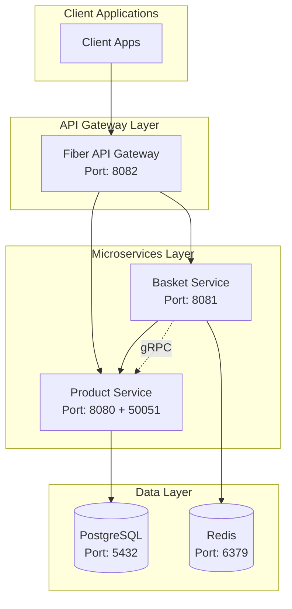
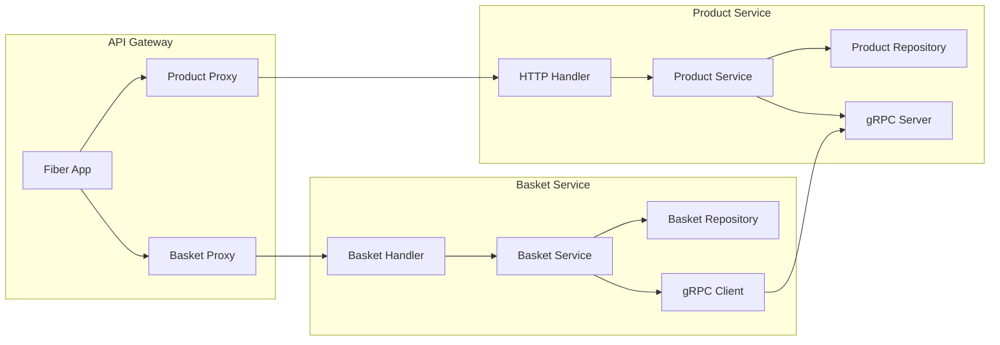

# Cluster IAC - Microservices Infrastructure

A modern, containerized microservices architecture built with Go, featuring product management, shopping basket functionality, and an API gateway. This project demonstrates a scalable, production-ready infrastructure using Docker Compose for orchestration.

## Architecture Overview



## Service Architecture



## Features

- **Product Management**: Full CRUD operations for products with category-based filtering
- **Shopping Basket**: Redis-based basket management with product validation
- **API Gateway**: Unified entry point with reverse proxy capabilities
- **gRPC Communication**: Internal service communication for product lookups
- **Health Monitoring**: Built-in health checks for all services
- **Container Orchestration**: Docker Compose for easy deployment
- **Database Persistence**: PostgreSQL for products, Redis for baskets

## Technology Stack

- **Backend**: Go 1.24
- **Web Framework**: Gin (Product/Basket), Fiber (Gateway)
- **Database**: PostgreSQL 16 with GORM
- **Cache**: Redis 7
- **Communication**: gRPC + HTTP
- **Containerization**: Docker + Docker Compose
- **API Documentation**: RESTful endpoints

## Quick Start

### Prerequisites

- Docker and Docker Compose
- Go 1.24+ (for local development)

### Running with Docker Compose

1. Clone the repository:
```bash
git clone <your-repo-url>
cd cluster-iac
```

2. Start all services:
```bash
docker-compose up -d
```

3. Verify services are running:
```bash
docker-compose ps
```

4. Check health endpoints:
```bash
curl http://localhost:8082/health    # Gateway
curl http://localhost:8080/health    # Product Service
curl http://localhost:8081/health    # Basket Service
```

### Local Development

1. Install dependencies:
```bash
go mod download
```

2. Set up environment variables (copy from `config.env.example`):
```bash
cp config.env.example config.env
# Edit config.env with your local settings
```

3. Run services individually:
```bash
# Product Service
go run cmd/product/main.go

# Basket Service
go run cmd/basket/main.go

# API Gateway
go run fiber-gateway/main.go
```

## API Endpoints

### Product Service

| Method | Endpoint | Description |
|--------|----------|-------------|
| `POST` | `/products` | Create a new product |
| `GET` | `/products` | Get all products |
| `GET` | `/products/category?category=<name>` | Get products by category |
| `GET` | `/products/:id` | Get product by ID |
| `PUT` | `/products/:id` | Update product |
| `DELETE` | `/products/:id` | Delete product |

### Basket Service

| Method | Endpoint | Description |
|--------|----------|-------------|
| `GET` | `/baskets/:user_id` | Get user's basket |
| `POST` | `/baskets/:user_id/items` | Add item to basket |
| `PUT` | `/baskets/:user_id/items/:product_id` | Update item quantity |
| `DELETE` | `/baskets/:user_id/items/:product_id` | Remove item from basket |
| `DELETE` | `/baskets/:user_id` | Clear entire basket |

### API Gateway

The gateway provides unified access to both services with two routing patterns:

- **Modern API**: `/api/products/*` and `/api/baskets/*`
- **Legacy Support**: `/products/*` and `/baskets/*` (for backward compatibility)

## Data Models

### Product

```go
type Product struct {
    ID          uint           `json:"id" gorm:"primaryKey"`
    Name        string         `json:"name" gorm:"not null"`
    Description string         `json:"description"`
    Price       float64        `json:"price" gorm:"not null"`
    Stock       int            `json:"stock" gorm:"not null;default:0"`
    Category    string         `json:"category"`
    ImageURL    string         `json:"image_url"`
    CreatedAt   time.Time      `json:"created_at"`
    UpdatedAt   time.Time      `json:"updated_at"`
    DeletedAt   gorm.DeletedAt `json:"deleted_at,omitempty" gorm:"index"`
}
```

### Basket

```go
type Basket struct {
    UserID    string       `json:"user_id"`
    Items     []BasketItem `json:"items"`
    Total     float64      `json:"total"`
    CreatedAt time.Time    `json:"created_at"`
    UpdatedAt time.Time    `json:"updated_at"`
}

type BasketItem struct {
    ProductID   uint    `json:"product_id"`
    Name        string  `json:"name"`
    Description string  `json:"description"`
    Price       float64 `json:"price"`
    ImageURL    string  `json:"image_url"`
    Quantity    int     `json:"quantity"`
}
```

## Configuration

### Environment Variables

#### Product Service
- `DB_HOST`: PostgreSQL host (default: localhost)
- `DB_PORT`: PostgreSQL port (default: 5432)
- `DB_USER`: Database username (default: postgres)
- `DB_PASSWORD`: Database password (default: postgres)
- `DB_NAME`: Database name (default: cluster_iac)
- `DB_SSLMODE`: SSL mode (default: disable)
- `SERVER_PORT`: HTTP server port (default: 8080)

#### Basket Service
- `REDIS_ADDR`: Redis address (default: localhost:6379)
- `REDIS_PASSWORD`: Redis password (default: empty)
- `REDIS_DB`: Redis database number (default: 0)
- `BASKET_SERVER_PORT`: HTTP server port (default: 8081)
- `PRODUCT_GRPC_ADDR`: Product service gRPC address (default: localhost:50051)

#### API Gateway
- `PRODUCT_SERVICE_URL`: Product service HTTP URL
- `BASKET_SERVICE_URL`: Basket service HTTP URL
- `GATEWAY_PORT`: Gateway HTTP port (default: 8082)

## Development

### Project Structure

```
cluster-iac/
├── api/
│   └── proto/           # gRPC protocol buffers
├── cmd/
│   ├── basket/          # Basket service entry point
│   └── product/         # Product service entry point
├── dockerfiles/         # Docker build files
├── fiber-gateway/       # API Gateway implementation
├── internal/
│   ├── basket/          # Basket service internals
│   └── product/         # Product service internals
├── docker-compose.yml   # Service orchestration
└── go.mod              # Go module definition
```

### Adding New Services

1. Create service directory in `internal/`
2. Implement handler, service, and repository layers
3. Add service to `docker-compose.yml`
4. Update API Gateway with new routes
5. Add health checks and monitoring

### Testing

```bash
# Run all tests
go test ./...

# Run tests with coverage
go test -cover ./...

# Run specific service tests
go test ./internal/product/...
go test ./internal/basket/...
```

## Deployment

### Production Considerations

- Enable TLS/SSL for all HTTP endpoints
- Implement authentication and authorization
- Add monitoring and logging (Prometheus, ELK stack)
- Configure database connection pooling
- Set up backup and disaster recovery
- Use secrets management for sensitive data

### Scaling

- Horizontal scaling with load balancers
- Database read replicas for read-heavy workloads
- Redis clustering for high availability
- Service mesh for advanced traffic management

## Contributing

1. Fork the repository
2. Create a feature branch
3. Make your changes
4. Add tests for new functionality
5. Ensure all tests pass
6. Submit a pull request

## License

This project is licensed under the Apache License 2.0 - see the [LICENSE](LICENSE) file for details.

## Support

For questions and support, please open an issue in the GitHub repository or contact the development team.

---

**Note**: This is a demonstration project showcasing microservices architecture patterns. For production use, please review security, performance, and operational requirements.
